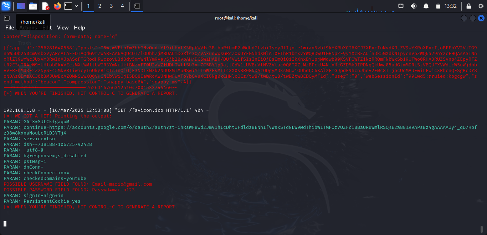

# Phishing para captura de senhas do Google.com
>Este desafio de projeto faz parte do conteúdo abordado pelo *Santander Bootcamp Cibersegurança*,
>realizado pela [DIO](https://web.dio.me/track/santander-bootcamp-ciberseguranca?tab=about)
>em parceria com o Santander Universidades.
>
### Ferramentas

- Kali Linux
- setoolkit

### Configurando o Phishing no Kali Linux

- Acesso root: ``` sudo su ```
- Iniciando o setoolkit: ``` setoolkit ```
- Tipo de ataque: ``` Social-Engineering Attacks ```
- Vetor de ataque: ``` Web Site Attack Vectors ```
- Método de ataque: ```Credential Harvester Attack Method ```
- Método de ataque: ``` Web Templates ```
- Obtendo o endereço da máquina: ``` ifconfig ```
- Template: ```Google```

### Resutados


